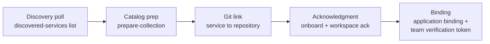

# Postman Onboarding: Insights Linking

[](https://github.com/postman-cs/postman-insights-onboarding-action/actions/workflows/ci.yml) [](https://github.com/postman-cs/postman-insights-onboarding-action/releases) [](https://www.npmjs.com/package/@postman-cse/onboarding-insights) [](LICENSE)

Links [Postman Insights](https://learning.postman.com/docs/insights/overview/) discovered services to [API Catalog](https://learning.postman.com/docs/api-catalog/overview/) workspaces and git repositories after deployment, so every service the Insights agent finds lands in your catalog with a collection, a repo link, and live telemetry.

Part of the [Postman API Onboarding suite](https://github.com/postman-cs/postman-api-onboarding-action); the composite action's README has the full [action-picker table](https://github.com/postman-cs/postman-api-onboarding-action#which-action-should-i-use).

- [Prerequisites](#prerequisites)
- [Usage](#usage)
- [Examples](#examples)
- [Inputs](#inputs) / [Outputs](#outputs)
- [How it works](#how-it-works)

## Prerequisites

- The [Postman Insights DaemonSet agent](https://learning.postman.com/docs/api-catalog/connect/insights/) must already be running on your cluster in discovery mode.
- The target service must already be deployed, running, and receiving enough traffic for the agent to discover it.
- A [Postman workspace](https://learning.postman.com/docs/collaborating-in-postman/using-workspaces/overview/) and environment must already exist for the service.
- A human-user PMAK and matching human-user session access token must be available as CI secrets. Service-account credentials cannot complete Insights linking.
- Choose the Postman data residency region up front with `postman-region` (`us` or `eu`).

This action does **not** deploy the Insights agent, create workspaces, create environments, upload OpenAPI specs, or sync repo artifacts. It only links a service that Insights has already discovered.

> **Credential requirement.** Supply a human-user PMAK and that same user's session access token. The action validates `GET /me` and `consumerType=user` before linking writes. It never mints or refreshes access tokens from a PMAK.

## Usage

```yaml
jobs:
  deploy:
    runs-on: ubuntu-latest
    steps:
      - uses: actions/checkout@v5

      # ... deploy your service to Kubernetes ...

      - uses: postman-cs/postman-insights-onboarding-action@v2
        with:
          project-name: core-payments
          workspace-id: ${{ vars.POSTMAN_WORKSPACE_ID }}
          environment-id: ${{ vars.POSTMAN_ENVIRONMENT_ID }}
          postman-region: us
          postman-api-key: ${{ secrets.POSTMAN_INSIGHTS_USER_PMAK }}
          postman-access-token: ${{ secrets.POSTMAN_INSIGHTS_USER_ACCESS_TOKEN }}
```

## Examples

### Standalone after a Kubernetes deploy

```yaml
jobs:
  deploy:
    runs-on: ubuntu-latest
    steps:
      - uses: actions/checkout@v5

      # ... deploy your service to Kubernetes ...

       - uses: postman-cs/postman-insights-onboarding-action@v2
        with:
          project-name: core-payments
          workspace-id: ${{ vars.POSTMAN_WORKSPACE_ID }}
          environment-id: ${{ vars.POSTMAN_ENVIRONMENT_ID }}
          cluster-name: my-cluster
          postman-region: us
           postman-api-key: ${{ secrets.POSTMAN_INSIGHTS_USER_PMAK }}
           postman-access-token: ${{ secrets.POSTMAN_INSIGHTS_USER_ACCESS_TOKEN }}
          github-token: ${{ secrets.GITHUB_TOKEN }}
          poll-timeout-seconds: 180
```

### Full onboarding pipeline

```yaml
jobs:
  provision:
    runs-on: ubuntu-latest
    steps:
      - uses: actions/checkout@v5

      - id: postman_token
        uses: postman-cs/postman-resolve-service-token-action@v2
        with:
          postman-api-key: ${{ secrets.POSTMAN_API_KEY }}
          postman-region: us

      - uses: postman-cs/postman-bootstrap-action@v2
        id: bootstrap
        with:
          project-name: core-payments
          spec-url: https://raw.githubusercontent.com/postman-cs/postman-insights-onboarding-action/main/examples/core-payments-openapi.yaml
          postman-region: us
          postman-api-key: ${{ secrets.POSTMAN_API_KEY }}
          postman-access-token: ${{ steps.postman_token.outputs.token }}

      # ... deploy service to Kubernetes ...

      - uses: postman-cs/postman-repo-sync-action@v2
        id: sync
        with:
          project-name: core-payments
          workspace-id: ${{ steps.bootstrap.outputs.workspace-id }}
          baseline-collection-id: ${{ steps.bootstrap.outputs.baseline-collection-id }}
          smoke-collection-id: ${{ steps.bootstrap.outputs.smoke-collection-id }}
          contract-collection-id: ${{ steps.bootstrap.outputs.contract-collection-id }}
          environments-json: '["prod"]'
          env-runtime-urls-json: '{"prod":"https://api.example.com"}'
          postman-region: us
          postman-api-key: ${{ secrets.POSTMAN_API_KEY }}
          postman-access-token: ${{ steps.postman_token.outputs.token }}

      - uses: postman-cs/postman-insights-onboarding-action@v2
        with:
          project-name: core-payments
          workspace-id: ${{ steps.bootstrap.outputs.workspace-id }}
          environment-id: ${{ fromJSON(steps.sync.outputs.environment-uids-json).prod }}
          cluster-name: my-cluster
          postman-region: us
           postman-api-key: ${{ secrets.POSTMAN_INSIGHTS_USER_PMAK }}
           postman-access-token: ${{ secrets.POSTMAN_INSIGHTS_USER_ACCESS_TOKEN }}
          github-token: ${{ secrets.GITHUB_TOKEN }}
```

### Tuning discovery polling

The Insights agent takes time to discover services after pods start. The action polls the [API Catalog](https://learning.postman.com/docs/api-catalog/connect/insights/) discovered-services list until the service appears or the timeout is reached. For services that take longer to appear (cold cluster, large pod startup time), raise the timeout:

```yaml
      - uses: postman-cs/postman-insights-onboarding-action@v2
        with:
          project-name: core-payments
          workspace-id: ${{ vars.POSTMAN_WORKSPACE_ID }}
          environment-id: ${{ vars.POSTMAN_ENVIRONMENT_ID }}
          postman-region: us
           postman-api-key: ${{ secrets.POSTMAN_INSIGHTS_USER_PMAK }}
           postman-access-token: ${{ secrets.POSTMAN_INSIGHTS_USER_ACCESS_TOKEN }}
          poll-timeout-seconds: 300
          poll-interval-seconds: 15
```

`poll-timeout-seconds` is clamped to 10-600 and `poll-interval-seconds` to 2-60. If the service never appears within the timeout, the action sets `status` to `not-found` and emits a warning without failing the workflow.

### Credential preflight modes

Before any onboarding write, the action verifies that `postman-api-key` and `postman-access-token` resolve to the same parent organization. The default `enforce` mode fails the run fast on mismatched credentials; set `credential-preflight` to `warn` to log and continue as an explicit compatibility policy:

```yaml
      - uses: postman-cs/postman-insights-onboarding-action@v2
        with:
          project-name: core-payments
          workspace-id: ${{ vars.POSTMAN_WORKSPACE_ID }}
          environment-id: ${{ vars.POSTMAN_ENVIRONMENT_ID }}
           postman-access-token: ${{ secrets.POSTMAN_INSIGHTS_USER_ACCESS_TOKEN }}
           postman-api-key: ${{ secrets.POSTMAN_INSIGHTS_USER_PMAK }}
          credential-preflight: enforce
```

See [Credentials and Identity](docs/credentials.md) for the full policy, API-key opt-in creation, and how to obtain the access token.

### Non-GitHub CI via the CLI

The same logic ships as a CLI (`postman-insights-onboard`) for GitLab CI, Bitbucket Pipelines, Azure DevOps, and other CI systems:

```bash
npm install -g @postman-cse/onboarding-insights
postman-insights-onboard \
  --project-name core-payments \
  --workspace-id ws_123 \
  --environment-id env_123 \
   --postman-access-token "$POSTMAN_INSIGHTS_USER_ACCESS_TOKEN" \
   --postman-api-key "$POSTMAN_INSIGHTS_USER_PMAK" \
  --postman-region us \
  --cluster-name my-cluster
```

See [CLI Usage](docs/cli.md) for provider auto-detection, output formats, and GitLab/Bitbucket/Azure pipeline examples.

### Self-contained binary (no npm / no Node)

For locked-down CI (Jenkins, Bitbucket Pipelines on a bare agent) that cannot install npm or Node, the action also ships as a single self-contained executable — the Node runtime and bundle baked into one file, so the target needs no npm, no Node, and no package-registry access. It is built and smoke-tested natively in CI and attached as a GitHub Release asset (`postman-insights-onboard-<version>-linux-x64`, currently linux-x64 only).

```bash
VERSION=2.1.8   # set to the release that carries the binary
curl -fsSL -o postman-insights-onboard \
  "https://github.com/postman-cs/postman-insights-onboarding-action/releases/download/v${VERSION}/postman-insights-onboard-${VERSION}-linux-x64"
chmod +x postman-insights-onboard
./postman-insights-onboard --version
```

Credentials resolve from a flag, the `INPUT_*` env var, or a plain `POSTMAN_ACCESS_TOKEN` / `POSTMAN_API_KEY` env var (in that order), so Jenkins `withCredentials` works with no flags. Both are **human-user** credentials and both are required: the access token is a session token that **cannot be minted from a PMAK**, and the PMAK binds the observability application. "Self-contained" means the runtime is bundled, not that the run is network-isolated — it still needs outbound access to the Postman API, Bifrost, iapub, and observability hosts. See [Self-contained binary](docs/self-contained-binary.md) for the full runbook, network allowlist, and a Jenkins pipeline example.

## Inputs

<!-- inputs-table:start -->
| Name | Description | Required | Default |
| --- | --- | --- | --- |
| `project-name` | Service name or Jira/Xray project key to match against the final discovered-service segment | Yes |  |
| `workspace-id` | Postman workspace ID to link the discovered service to | Yes |  |
| `environment-id` | Postman environment UID for the onboarding association | Yes |  |
| `system-environment-id` | Postman system environment UUID for service-level Insights acknowledgment | No |  |
| `cluster-name` | Insights cluster name. When set, matches {cluster-name}/{project-name} exactly in discovered services | No |  |
| `repo-url` | Repository URL for Git onboarding. Auto-detected from CI context when omitted. | No |  |
| `postman-access-token` | Required human-user session access token (x-access-token) for Bifrost and Akita linking calls. Service-account tokens are rejected and this action never mints or refreshes a token from a PMAK. | No |  |
| `postman-team-id` | Explicit Postman team ID for org-mode integration request headers. When omitted, x-entity-team-id is not sent. | No |  |
| `github-token` | Optional GitHub token passed as git_api_key when repository auth is required by onboarding/git | No |  |
| `postman-api-key` | Human-user Postman API key (PMAK-*) for observability application binding. It must resolve to the same human user as postman-access-token; service-account PMAKs are rejected. | No |  |
| `create-api-key` | Explicit opt-in to create a durable Bifrost API key when postman-api-key is omitted or invalid. Default false — never creates timestamp-named orphan keys on ordinary runs. Supported values: true, false. | No | `false` |
| `credential-preflight` | Credential identity preflight policy. Both modes require a human-user access token with consumerType=user; enforce additionally fails on parent-org mismatch. | No | `enforce` |
| `service-not-found-policy` | Behavior when the discovered service is absent after polling. fail (default) aborts full linking; warn returns status=not-found without writes. Supported values: fail, warn. | No | `fail` |
| `poll-timeout-seconds` | Maximum seconds to wait for the service to appear in the discovered list | No | `120` |
| `poll-interval-seconds` | Seconds between discovery polling attempts | No | `10` |
| `postman-region` | Postman data residency region for public API calls. One of: us or eu. | No | `us` |
| `branch-strategy` | Branch-aware sync strategy. legacy (default) keeps branch-blind behavior; publish-gate restricts canonical writes to the canonical branch and skips on other branches; preview additionally maintains suffixed per-branch preview asset sets. | No | `legacy` |
| `canonical-branch` | Explicit canonical branch (the sole writer of canonical assets). Defaults to the provider-resolved default branch. | No |  |
| `channels` | Comma-separated channel map for long-lived promotion branches. | No |  |
<!-- inputs-table:end -->

Supply `postman-team-id` only for org-mode tokens that require an explicit team header. For non-org tokens, leave it unset so Postman can infer team context from the access token. Team id is never inferred from PMAK. Credential details, the preflight policy, and API-key opt-in creation are documented in [Credentials and Identity](docs/credentials.md).

## Outputs

<!-- outputs-table:start -->
| Name | Description | Required | Default |
| --- | --- | --- | --- |
| `discovered-service-id` | Numeric ID from the API Catalog discovered-services list |  |  |
| `discovered-service-name` | Full cluster/service name of the discovered service |  |  |
| `collection-id` | Collection ID returned by the prepare-collection step |  |  |
| `application-id` | Insights application binding ID from the observability API |  |  |
| `verification-token` | Insights team verification token (tvt_*) for DaemonSet telemetry |  |  |
| `status` | Onboarding result: success, not-found, or error |  |  |
| `sync-status` | Branch-aware sync status: synced, skipped-branch-gate, or empty under branch-strategy legacy. |  |  |
| `branch-decision` | Serialized BranchDecision JSON for downstream actions (also exported as POSTMAN_BRANCH_DECISION). |  |  |
<!-- outputs-table:end -->

Failures set `status=error` before the action exits.

## How it works



**Discovery poll.** The action polls the API Catalog discovered-services list at the configured interval until a service matching `{cluster-name}/{project-name}` appears (suffix matching when `cluster-name` is omitted) or the timeout is reached.

**Catalog prep.** It then calls `POST /api/v1/onboarding/prepare-collection` to create the API Catalog collection entry for the discovered service in your workspace.

**Git link.** `POST /api/v1/onboarding/git` with `via_integrations: false` links the service to the GitHub repository (`repo-url` input, auto-detected from CI context when omitted; `github-token` is passed as `git_api_key` only when the endpoint requires repository auth). The [connect code](https://learning.postman.com/docs/api-catalog/connect/code/) docs cover the product workflow this binding supports.

**Acknowledgment.** The action resolves the `svc_*` Akita service ID, marks the service as managed (`POST /v2/api-catalog/services/onboard`), and acknowledges the workspace (`POST /v2/workspaces/{id}/onboarding/acknowledge`) to activate the Insights project.

**Binding.** Finally it creates an application binding with the observability API, which is required for service graph edge generation, and retrieves the team verification token (`tvt_*`) for DaemonSet telemetry.

For local builds, contract smoke monitoring, and release channels, see [Development and Operations](docs/development.md).

## Resources

- npm package: [@postman-cse/onboarding-insights](https://www.npmjs.com/package/@postman-cse/onboarding-insights)
- Docs in this repo: [Credentials and Identity](docs/credentials.md), [Development and Operations](docs/development.md), [CLI usage](docs/cli.md)
- Marketplace docs: [Support](SUPPORT.md), [Security Policy](SECURITY.md), [Release Policy](RELEASE_POLICY.md)
- Postman Learning Center: [Insights overview](https://learning.postman.com/docs/insights/overview/), [connect Insights](https://learning.postman.com/docs/api-catalog/connect/insights/), [Insights API Catalog agent reference](https://learning.postman.com/docs/insights/reference/agent/api-catalog/), [API Catalog overview](https://learning.postman.com/docs/api-catalog/overview/), [connect code](https://learning.postman.com/docs/api-catalog/connect/code/)

## Telemetry

The action sends one anonymous usage event per run (action name/version, outcome, coarse CI metadata; never secrets, spec content, or repo names). A run ending in the `not-found` state is recorded with a `failure` outcome. Disable with `POSTMAN_ACTIONS_TELEMETRY=off` or `DO_NOT_TRACK=1`; route events to your own collector with `POSTMAN_ACTIONS_TELEMETRY_ENDPOINT`.

## License

[MIT](LICENSE)
